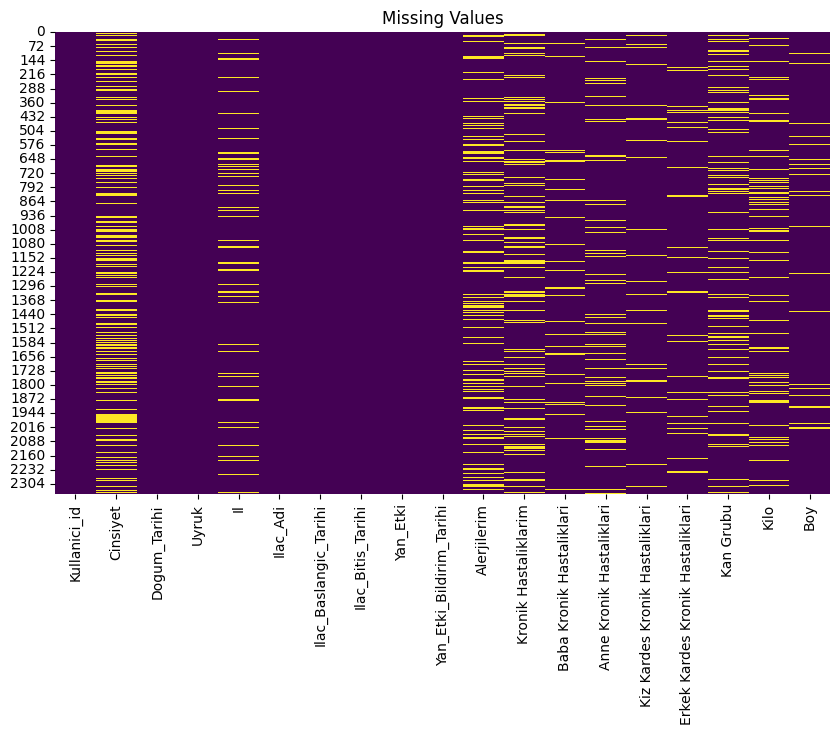
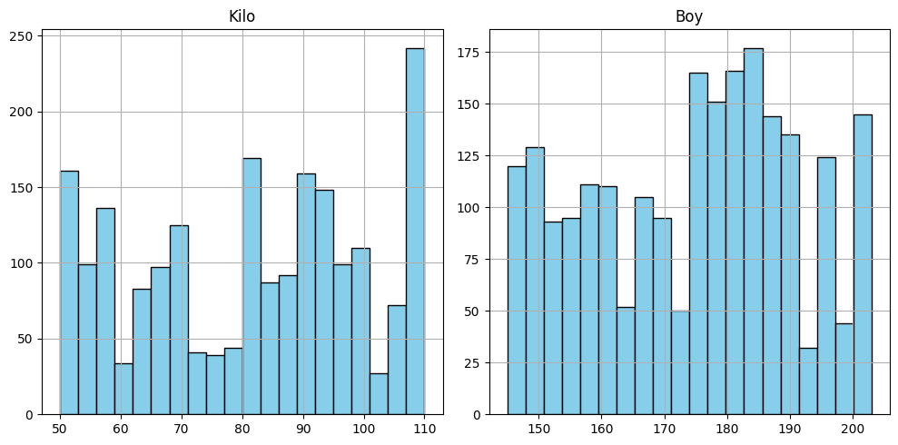

## Fatih Han Özkan

# Data Analysis and Preprocessing Project

## Table of Contents
- [How to Run](#how-to-run)

- [Introduction](#introduction)
- [Dataset Overview](#dataset-overview)
- [Exploratory Data Analysis (EDA)](#exploratory-data-analysis-eda)
  - [Missing Values Heatmap](#missing-values-heatmap)
  - [Distribution of Weight and Height](#distribution-of-weight-and-height)
- [Data Preprocessing](#data-preprocessing)
  - [Handling Missing Data](#handling-missing-data)
  - [Encoding Categorical Variables](#encoding-categorical-variables)
  - [Splitting Data](#splitting-data)
  - [Scaling Numerical Variables](#scaling-numerical-variables)
- [Modeling](#modeling)
- [Conclusion](#conclusion)

---
## How to Run

To run this project on your local machine, follow these quick steps:

1. **Clone the Repository:**
   ```bash
   git clone https://github.com/username/repository-name.git
   cd repository-name
   ```

2. **Set Up a Virtual Environment:**
   - For Windows:
     ```bash
     python -m venv venv
     venv\Scripts\activate
     ```
   - For MacOS/Linux:
     ```bash
     python3 -m venv venv
     source venv/bin/activate
     ```

3. **Install Dependencies:**
   ```bash
   pip install -r requirements.txt
   ```

4. **Run the Jupyter Notebook:**
   Start the notebook server:
   ```bash
   jupyter notebook
   ```
   Navigate to the `.ipynb` file in your browser and run the cells.

5. **Deactivate the Virtual Environment:**
   Once done, deactivate the virtual environment:
   ```bash
   deactivate
   ```
## Introduction

This project involves performing exploratory data analysis (EDA) and preprocessing on a dataset related to users, medications, side effects, and allergies. The primary goal is to clean the dataset, handle missing values, encode categorical variables, and prepare the data for machine learning models.

## Dataset Overview

The dataset contains various columns including:
- **Cinsiyet (Gender)**
- **Kan Grubu (Blood Type)**
- **Boy (Height)**
- **Kilo (Weight)**
- Several other columns related to medications, allergies, and chronic diseases.

There are a total of 19 columns, with some columns containing missing values, particularly `Cinsiyet`, `Kilo`, and `Boy`. Here's a summary of the dataset structure:

```
<class 'pandas.core.frame.DataFrame'>
RangeIndex: 2357 entries, 0 to 2356
Data columns (total 19 columns):
 #   Column                       Non-Null Count  Dtype
---  ------                       --------------  -----
 0   Kullanici_id                 2357 non-null   int64
 1   Cinsiyet                     1579 non-null   object
 2   Dogum_Tarihi                 2357 non-null   datetime64[ns]
 3   Uyruk                        2357 non-null   object
 4   Il                           2130 non-null   object
 5   Ilac_Adi                     2357 non-null   object
 6   Kilo                         2064 non-null   float64
 7   Boy                          2243 non-null   float64
 8   Kan Grubu                    2010 non-null   object
...
```

---

## Exploratory Data Analysis (EDA)

### Missing Values Heatmap

The first step in the analysis was to identify missing values in the dataset. A heatmap visualization was generated to highlight the missing data across the different columns.



- **Key Finding**: Missing data was identified in critical columns like `Cinsiyet`, `Kilo`, and `Boy`. This necessitated various imputation techniques to fill in the gaps.

### Distribution of Weight and Height

The dataset contains information on users' weight and height. The histograms below show the distribution of these numerical variables.



- **Key Finding**: Most users have weights between 60-100 kg, and heights range from 160-190 cm, with a few outliers in both categories.

---

## Data Preprocessing

### Handling Missing Data

To handle missing values in `Cinsiyet`, we trained a RandomForestClassifier model using `Kan Grubu`, `Boy`, and `Kilo` as predictors. The missing `Cinsiyet` values were then predicted and filled in using this model.

```python
# Code snippet
model = RandomForestClassifier(random_state=42)
model.fit(X_train, y_train)
predicted_gender = model.predict(missing_gender)
df.loc[df['Cinsiyet'].isna(), 'Cinsiyet'] = le_gender.inverse_transform(predicted_gender)
```

- For numerical columns such as `Kilo` and `Boy`, mean imputation was used based on the gender of the users.

### Encoding Categorical Variables

Categorical variables were encoded using the following techniques:
- **Label Encoding** for binary categorical variables like `Cinsiyet` and `Kan Grubu`.
- **OneHotEncoding** for larger categorical variables such as `Uyruk`, `Ilac_Adi`, and family health columns.

```python
# OneHot Encoding
encoder = OneHotEncoder(sparse_output=False, drop='first')
encoded_df = pd.DataFrame(encoder.fit_transform(df[categorical_cols]))
```

### Splitting Data

The data was split into training and test sets with an 80/20 ratio. This ensured that the model could be evaluated on unseen data.

```python
X_train, X_test, y_train, y_test = train_test_split(X, y, test_size=0.2, random_state=42)
```

### Scaling Numerical Variables

To standardize the numerical columns (`Kilo` and `Boy`), a **StandardScaler** was used. This step ensured that all features were on the same scale, which is essential for many machine learning models.

```python
scaler = StandardScaler()
df[numerical_cols] = scaler.fit_transform(df[numerical_cols])
```

---

## Modeling

We utilized the **RandomForestClassifier** to predict missing values for the `Cinsiyet` column. The classifier was trained on complete records and achieved satisfactory performance in filling the missing data.

The model was evaluated using accuracy metrics on the test set.

```python
accuracy = model.score(X_test, y_test)
print(f"Model Accuracy: {accuracy}")
```

---

## Conclusion

This project successfully handled a variety of data preprocessing tasks including:
- Handling missing data using machine learning-based imputation for categorical features and mean imputation for numerical features.
- Encoding categorical variables efficiently using both label encoding and one-hot encoding.
- Preparing the dataset for machine learning models through feature scaling and splitting.

### Next Steps:
- Experiment with hyperparameter tuning for the RandomForest model.
- Explore other machine learning models for more accurate predictions.
- Integrate more advanced techniques for missing data imputation.

---
